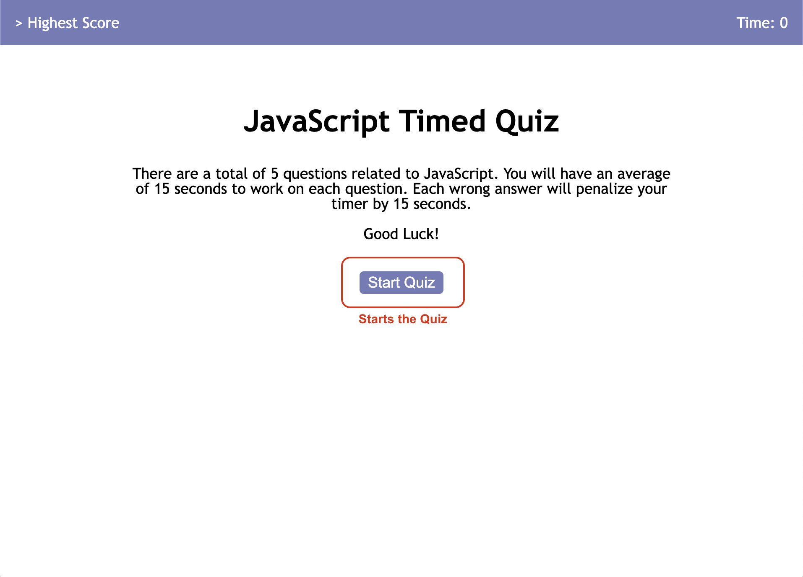
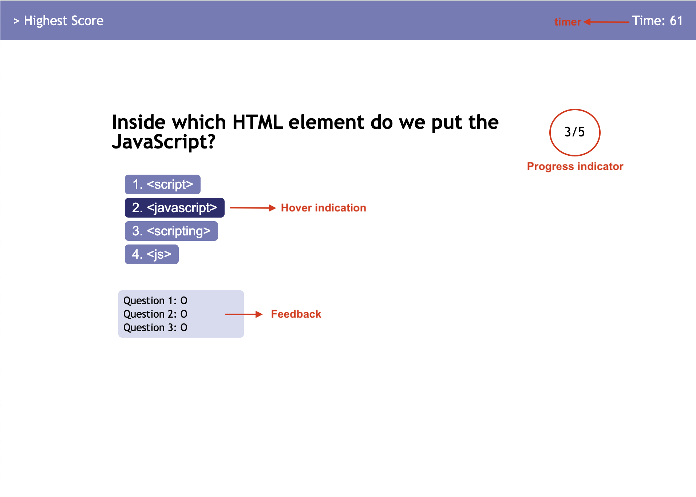
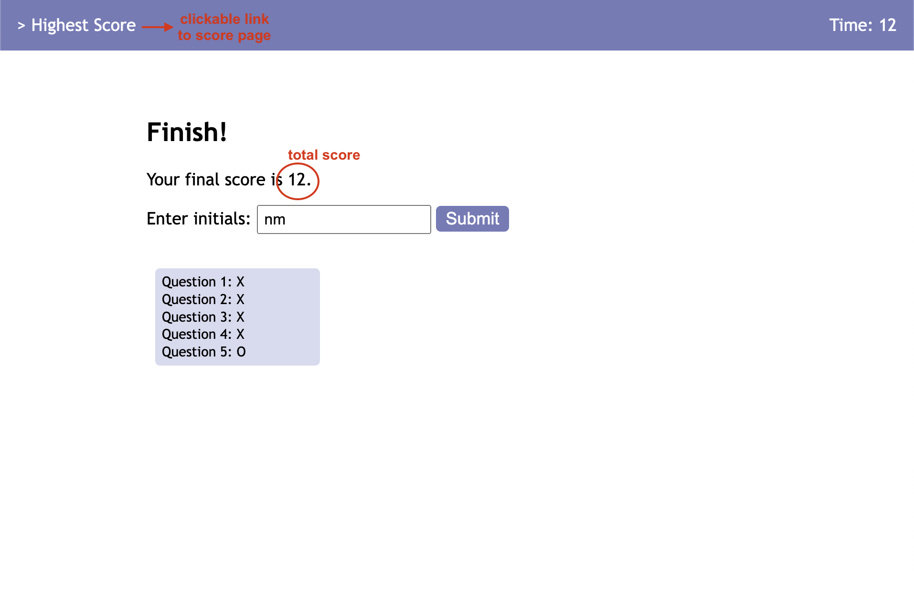
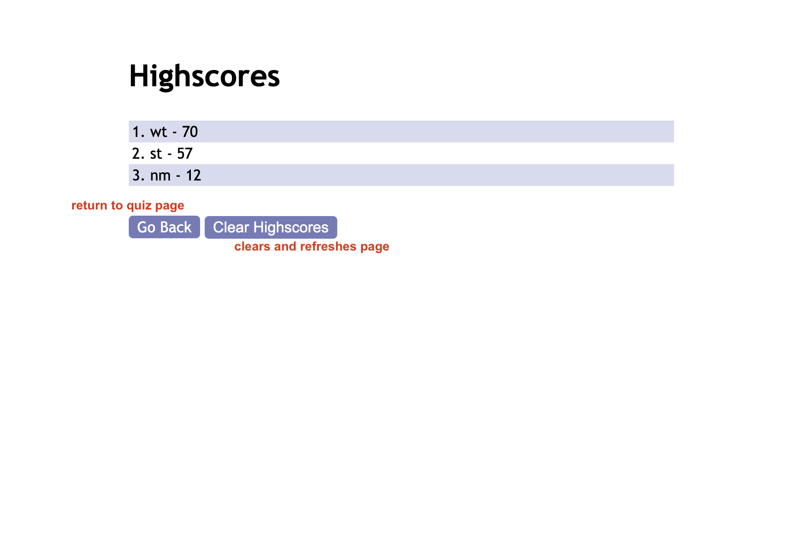

# JavaScript Timed Quiz

## Description

This is a timed quiz designed for UCI Coding Bootcamp students to review JavaScript related topics. All questions are multiple choice, and time will be deducted if a question is answered wrong. 
In addition to taking the quiz, students can record their scores on a score board with their initials to motivate each other from improving. 

## Installation

N/A

## Usage

Here is the link to the JavaScript Timed Quiz: https://wytseng.github.io/javascript-timed-quiz/ 

Here is the link to the highscore page: https://wytseng.github.io/javascript-timed-quiz/highscores.html 

The starting page will include the quiz title and a short description section on the quiz explaining how the quiz works. 

Clicking on the "Start Quiz" button will bring users to the quiz sections.

The countdown timer is display in the upper right hand corner. Each wrong answer will deduct 15 seconds from that timer. Quiz will end automatically when time runs out or when all questions are complete.

Additionally, a small box will show up below the answer choices once the first quiz question is complete. It indicates the correctness of the previous answered questions. There is also an indicator for how many questions out of the total were completed to the right of the question prompt.

Once the quiz is complete, the page will show the ending screen where is shows the final score and the correctness box for all the questions. 

It will also prompt the user to enter initials to save score to record. After entering a valid string for the input, user may enter the information by either clicking on the "Submit" button or pressing enter key while in the input field.

The page will then automatically redirect you to the highscores page. Note that you may also access this page by clicking on "> Highest Score" at the upper left corner of the main page.

Lastly, the highscore page display an ordered list of the recorded highest scores. Users can clear the list by clicking on "Clear Highscores". Users can also go back to the main page by clicking on "Go Back". 

## Credits

N/A

## License

N/A